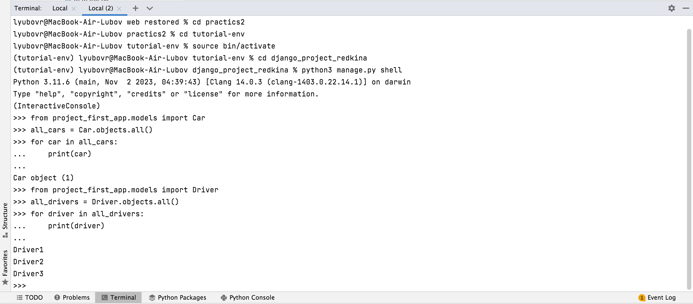

##Практика 3.1


###Задание 3.1.1
В первом задании первой практической работы нужно было написать запрос на создание 6 новых автовладельцев и 6 автомобилей, а также назначить каждому автовладельцу удостоверение и от 1 до 3 автомобилей. 

Задание было выполнено либо в отдельном `python`-файле. Вот его код:
```
from project_first_app.models import Driver, Car, DriverDocs, Ownership
from django.utils import timezone

# Создание 6 новых водителей, начиная с 4
for i in range(4, 10):
    driver = Driver.objects.create(
        username=f"Driver{i}",
        first_name=f"Driver{i}",
        last_name=f"Lastname{i}",
        birth_date=timezone.now().date(),
        passport=f"Passport{i}",
        address=f"Address{i}",
        nationality=f"Nationality{i}"
    )

    # Установка пароля и почты
    password = f"12345Qwerty"
    driver.set_password(password)
    driver.email = f"driver{i}@example.com"

    # Сохранение изменений
    driver.save()

# Создание 6 новых автомобилей
for i in range(2, 8):
    car = Car.objects.create(
        car_number=f"Car{i}",
        brand=f"Brand{i}",
        model=f"Model{i}",
        color=f"Color{i}"
    )

# Назначение удостоверения для каждого водителя
for driver in Driver.objects.all():
    DriverDocs.objects.create(
        driver_id=driver,
        docs_number=f"DocsNumber{driver.id}",
        type=f"Type{driver.id}",
        date_from=timezone.now().date()
    )

# Добавление связей Ownership между водителями и автомобилями
for i, (driver, car) in enumerate(zip(Driver.objects.all(), Car.objects.all())):
    Ownership.objects.create(
        driver_id=driver,
        car_id=car,
        date_from=timezone.now().date(),
        date_to=None
    )
```
Здесь можно увидеть выполнение запроса в консоли. 
Сначала состояние БД до выполнения запроса:


А здесь БД после вызова скрипта:

