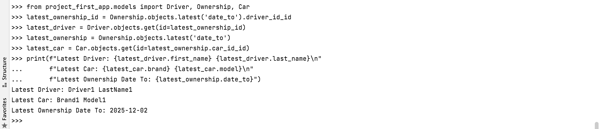

##Практика 3.3


###Задание 3.3.1
В первом задании третьей практической работы нужно вывести информацию по документам для водителя с самой ранней датой владения машиной.
Вот код запроса:
```
from project_first_app.models import Driver, Ownership, DriverDocs

# Получение информации о самых старых документах
oldest_ownership = Ownership.objects.earliest('date_from')
# Водитель соответсвующий наистарейшей дате
oldest_driver = Driver.objects.get(id=oldest_ownership.driver_id_id)

# Назначаем дату
oldest_date_from = oldest_ownership.date_from
# Используя назначенную дату находим соответствующие водительские права
oldest_driver_docs = DriverDocs.objects.filter(driver_id=oldest_ownership.driver_id_id).earliest('date_from')

# Вывод информации с новыми строками
print(f"Oldest Driver: {oldest_driver.first_name} {oldest_driver.last_name}\n"
      f"Oldest Ownership Date From: {oldest_date_from}\n"
      f"Oldest Driver Docs Info: {oldest_driver_docs.docs_number}, {oldest_driver_docs.type}")
```
Здесь можно увидеть выполнение запроса в консоли.


###Задание 3.3.2
Во втором задании третьей практической работы нужно вывести информацию о водителе и его машине, для которых владение заканчивается позже всего.
Вот код запроса:
```
from project_first_app.models import Driver, Ownership, Car

# Получение ID владельца с наибольшей датой окончания владения
latest_ownership_id = Ownership.objects.latest('date_to').driver_id_id

# Получение информации о водителе с наибольшей датой окончания владения
latest_driver = Driver.objects.get(id=latest_ownership_id)

# Получение объекта владения с наибольшей датой окончания владения
latest_ownership = Ownership.objects.latest('date_to')

# Получение информации о машине, для которой владение заканчивается позже всего
latest_car = Car.objects.get(id=latest_ownership.car_id_id)

# Вывод информации
print(f"Latest Driver: {latest_driver.first_name} {latest_driver.last_name}\n"
      f"Latest Car: {latest_car.brand} {latest_car.model}\n"
      f"Latest Ownership Date To: {latest_ownership.date_to}")
```
Здесь можно увидеть выполнение запроса в консоли.



###Задание 3.3.3
В третьем задании третьей практической работы нужно подсчитать количество машин для каждого водителя.
Вот код запроса:
```
from project_first_app.models import Driver, Ownership
from django.db.models import Count

# Получение информации о количестве машин для каждого водителя
drivers_with_car_count = Driver.objects.annotate(car_count=Count('ownership'))

# Вывод информации
for driver in drivers_with_car_count:
    print(f"Driver: {driver.first_name} {driver.last_name}, Car Count: {driver.car_count}")
```
Здесь можно увидеть выполнение запроса в консоли.


###Задание 3.3.4
В четвертом задании третьей практической работы нужно подсчитать количества машин каждой марки.
Вот код запроса:
```
from project_first_app.models import Car
from django.db.models import Count

# Получение информации о количестве машин для каждой марки
cars_by_brand_count = Car.objects.values('brand').annotate(car_count=Count('id'))

# Вывод информации
for car_info in cars_by_brand_count:
    print(f"Brand: {car_info['brand']}, Car Count: {car_info['car_count']}")
```
Здесь можно увидеть выполнение запроса в консоли.


###Задание 3.3.5
В пятом задании третьей практической работы нужно вывести информацию о владельцах, отсортированных по самой ранней дате выдачи удостоверения..
Вот код запроса:
```
from project_first_app.models import Driver, DriverDocs

# Получение всех владельцев, отсортированных по дате выдачи удостоверения
owners_sorted_by_docs_date = DriverDocs.objects.values('driver_id').order_by('date_from').distinct()

# Вывод информации
for owner_info in owners_sorted_by_docs_date:
    driver_id = owner_info['driver_id']
    driver = Driver.objects.get(id=driver_id)
    
    # Получение самой ранней даты выдачи удостоверения для данного владельца
    earliest_docs_date = DriverDocs.objects.filter(driver_id=driver_id).order_by('date_from').first().date_from
    
    print(f"Driver: {driver.first_name} {driver.last_name}, Docs Date From: {earliest_docs_date}")
```
Здесь можно увидеть выполнение запроса в консоли.
