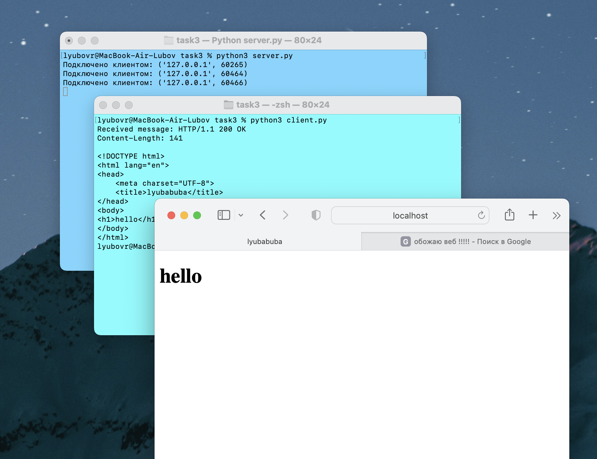

# task 3
###server.py
    # Импортируем модули socket и webbrowser для работы с сокетами и веб-браузером
    import socket
    import webbrowser
    
    # Создаем сокет TCP
    sock = socket.socket(socket.AF_INET, socket.SOCK_STREAM)
    
    # Привязываем сокет к локальному адресу и порту
    sock.bind(('localhost', 8080))
    
    # Ожидаем только одно подключениехотя впрочем зачем я это пишу
    sock.listen(1)
    
    # Открываем и читаем содержимое файла "index.html"
    with open("index.html", "r") as file:
        html = file.read()
    
    while True:
        # Принимаем подключение от клиента и получаем информацию о клиенте
        conn, addr = sock.accept()
        print(f"Подключено клиентом: {addr}")
    
        # Создаем HTTP-ответ, включая содержимое HTML-файла
        response = f"HTTP/1.1 200 OK\nContent-Length: {len(html)}\n\n{html}"
    
        # Отправляем HTTP-ответ клиенту
        conn.send(response.encode("utf-8"))
    
        # Закрываем соединение с клиентом
        conn.close()
    
    # Открываем веб-браузер и открываем веб-страницу по указанному адресу
    webbrowser.open('http://localhost:8080')

###client.py
    # Импортируем модуль socket для работы с сокетами
    import socket
    
    # Создаем сокет TCP
    sock = socket.socket(socket.AF_INET, socket.SOCK_STREAM)
    
    # Устанавливаем соединение с сервером
    sock.connect(('localhost', 8080))
    
    # Получаем данные от сервера
    data = sock.recv(1024)
    
    # Декодируем полученные данные из байтовой строки в строку UTF-8
    decoded_data = data.decode("utf-8")
    
    # Выводим полученное сообщение
    print("Received message:", decoded_data)
    
    # Закрываем сокет
    sock.close()

###index.html
    <!DOCTYPE html>
    <html lang="en">
    <head>
        <meta charset="UTF-8">
        <title>lyubabuba</title>
    </head>
    <body>
    <h1>hello</h1>
    </body>
    </html>

