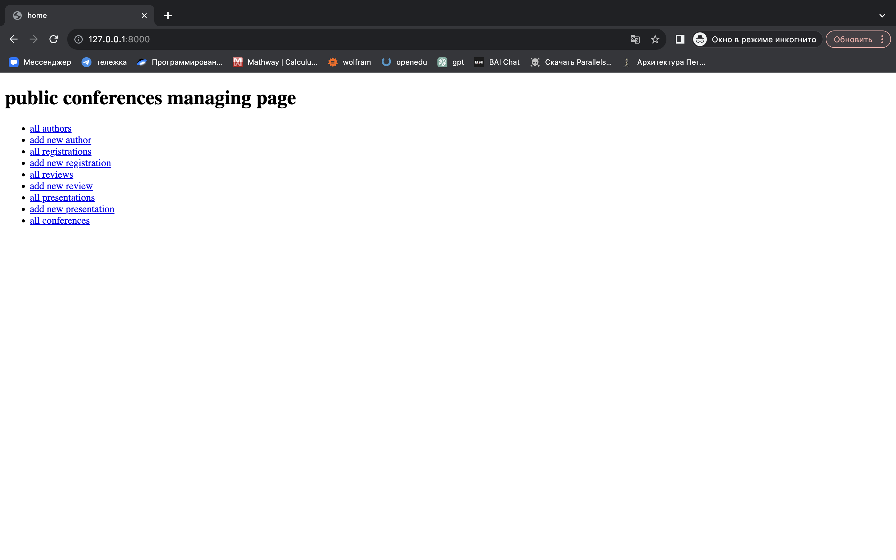
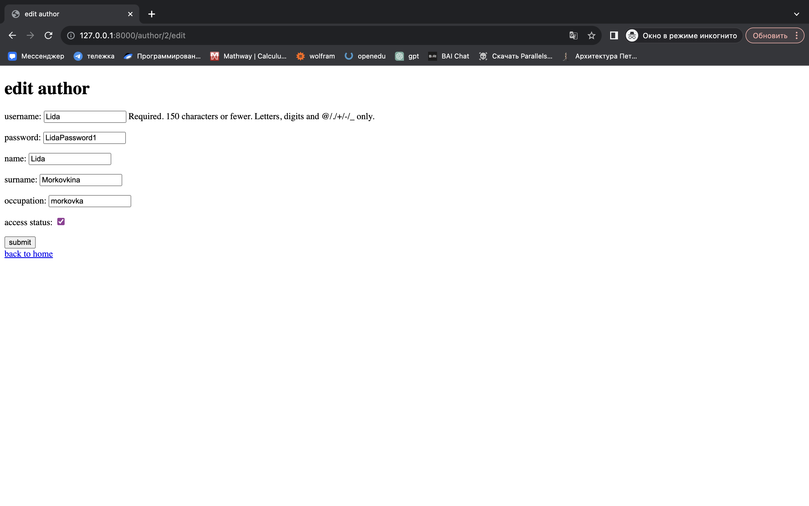

Для того, чтобы отобразить информацию приложения, необходимы шаблоны, которые я поместила в папку `templates`. 
Все шаблоны - это html-файлы. В отчете будут показаны не все, так как их весьма много и в целом они имеют схожу структуру.

Базовая страница - `home.html` содержит ссылки на все другие страницы.



Среди шаблонов есть группа файлов для просмотра всех объектов одного класса. 
Все эти страницы роднит то, что они:
1. содержат цикл для перебора всех объектов в списке.
2. объект представлен в виде элемента списка, где его аттрибуты являются гиперссылкой (`<a>`), ведущей на страницу деталей объекта (`'object_detail'`), используя идентификатор объекта (`object.id`).
3. содержат ссыоку для возврата на домашнюю страницу `<a href="">back to home</a>`
```
<!DOCTYPE html>
<html>
<head>
    <title>all authors</title>
</head>
<body>
    <h1>all authors</h1>

    <!-- Список всех авторов -->
    <ul>
        <!-- Цикл для перебора всех авторов в списке -->
        
            <li><a href="">{{ author.first_name }} {{ author.last_name }}</a></li>
        
    </ul>

    <!-- Ссылка для возврата на главную страницу -->
    <a href="">back to Home</a>
</body>
</html>
```


Далее следует другая группа файлов - это страницы для добавления новых объектов.
Их всех объединяет то, что они содержат: 
1. секцию для содержимого страницы `<body> <!-- Секция для содержимого страницы. -->`
2. форму для добавления нового автора `<form method="post" action="">`
3. ссылку для возврата на домашнюю страницу `<a href="">back to home</a>`
```
<!DOCTYPE html>
<html>
<head>
    <title>add new author</title>
</head>
<body> <!-- Секция для содержимого страницы. -->
    <h1>add new author</h1>

    <!-- Форма для добавления нового автора -->
    <form method="post" action="">
        
        {{ form.as_p }}   <!-- Вставка полей формы в виде параграфов -->
        <button type="submit">submit</button> <!-- Кнопка для отправки формы -->
    </form>

    <!-- Ссылка для возврата на главную страницу -->
    <a href="">back to home</a>
</body>
</html>
```


Затем есть группа просмотра информации по отдельному объекту.
Страницы этой группы:
1. содержат заголовк/другую отличительную информацию в качестве заголовка `<title>{{ object.feature }} details</title>`
2. имеют параграфы (`<p>`), отображающие информацию об объекте
3. ссылку для возврата на домашнюю страницу `<a href="">back to home</a>`
```
<!DOCTYPE html>
<html>
<head>
    <title>{{ author.first_name }} {{ author.last_name }} details</title>
</head>
<body>
    <h1>details on {{ author.first_name }} {{ author.last_name }}</h1>
    <p>occupation: {{ author.occupation }}</p>
    <p>admin status: {{ author.is_admin }}</p>
    <a href="">back to home</a>
</body>
</html>
```


Также есть группа страниц для редактирования информации по объекту.
Эти страницы:
1. содержат форму для отправки данных методом `POST` на `URL` 'edit_object' с указанием первичного ключа объекта в качестве параметра
2. вставка полей формы в виде параграфов, где форма автоматически создается на основе модели формы
3. имеют кнопкау для отправки данных формы `<button type="submit">submit</button>`
4. ссылку для возврата на домашнюю страницу `<a href="">back to home</a>`
```
<!DOCTYPE html>
<html>
<head>
    <title>edit author</title>
</head>
<body>
    <h1>edit author</h1>
    <form method="post" action="">
        
        {{ form.as_p }}
        <button type="submit">submit</button>
    </form>
    <a href="">back to home</a>
</body>
</html>
```



Кроме того, есть html-страница `conference_authors` для отображения списка авторов для конкретной конференции.
В нем есть:
1. цикл по словарю `authors_by_conference`, где `conference` - ключ (конференция), а `authors_info` - значение (список авторов)
2. вложенный цикл для прохода по списку авторов ``
3. отображение элемента списка с именем, фамилией автора и его занимаемой должностью на конференции
4. ссылка для возврата на домашнюю страницу `<a href="">back to home</a>`
```
<!DOCTYPE html>
<html>
<head>
    <title>conference authors</title>
</head>
<body>
    <h1></h1>

    
        <h2>{{ conference.title }}:</h2>
        <ul>
            
                <li>{{ info.author.first_name }} {{ info.author.last_name }} - {{ info.title }}</li>
            
        </ul>
    

    <a href="">back to Home</a>
</body>
</html>
```

